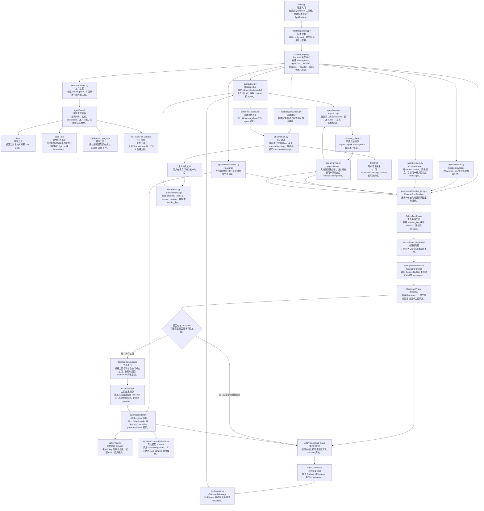

# Memoli-agent 运行链路流程图

本文档说明 `Memoli-agent` 当前主要运行链路。流程图中的节点附带中文功能说明，方便理解各模块之间如何协作。图中以工具系统主链路为基础；记忆、插件、SubAgent、Proactive 和 MCP 的细节见对应系统文档。

## 一、整体结构流程图



## 二、核心时序流程图

```mermaid
sequenceDiagram
    participant User as 用户<br/>在 CLI 输入文本
    participant CLI as channels/cli.py<br/>命令行通道
    participant Bus as MessageBus<br/>消息总线
    participant Loop as AgentLoop<br/>消息泵
    participant Runner as AgentRunner<br/>消息路由器
    participant Pipe as PassiveTurnPipeline<br/>被动对话流水线
    participant Ctx as ContextBuilder<br/>上下文构建器
    participant Reasoner as Reasoner<br/>推理器
    participant Tools as ToolRegistry<br/>工具注册表
    participant Provider as LLMProvider<br/>模型接口

    User->>CLI: 输入一句话
    CLI->>Bus: 发布 InboundMessage
    Loop->>Bus: consume_inbound()
    Loop->>Runner: handle_inbound(message)
    Runner->>Pipe: run(message)

    Pipe->>Pipe: BeforeTurn：获取 Session，创建 TurnState
    Pipe->>Pipe: BeforeReasoning：预留扩展点
    Pipe->>Ctx: PromptRender：渲染 messages
    Ctx-->>Pipe: 返回稳定 system/skill + memory + history + current user
    Pipe->>Reasoner: ReasonerPhase：generate(messages)

    Reasoner->>Reasoner: 调用前去重并追加唯一最新 agent_status
    Reasoner->>Provider: chat(messages, tools)
    Provider-->>Reasoner: 返回 LLMResponse

    alt 模型返回 tool_calls
        Reasoner->>Tools: execute(name, arguments)
        Tools-->>Reasoner: 返回 ToolResult
        Reasoner->>Reasoner: 按最新 revision 重建唯一 agent_status
        Reasoner->>Provider: chat(messages + tool result + agent_status, tools)
        Provider-->>Reasoner: 返回最终 LLMResponse
    else 模型没有返回 tool_calls
        Reasoner-->>Pipe: 直接使用第一次模型回复
    end

    Pipe->>Pipe: AfterReasoning：保存用户消息和助手回复
    Pipe->>Pipe: AfterTurn：创建 OutboundMessage
    Pipe-->>Runner: 返回 OutboundMessage
    Runner-->>Loop: 返回 OutboundMessage
    Loop->>Bus: publish_outbound()
    CLI->>Bus: consume_outbound()
    CLI-->>User: 打印回复
```

## 三、节点功能对照表

| 节点 | 文件 | 功能说明 |
| --- | --- | --- |
| 程序入口 | `main.py` | 启动 asyncio 主流程，调用配置加载和 runtime 装配。 |
| 配置加载 | `bootstrap/config.py` | 读取 `config.toml`，提供 agent、LLM、workspace、channel 等配置。 |
| Runtime 装配中心 | `bootstrap/app.py` | 创建并连接整个 agent 所需对象，是项目启动时的总装配点。 |
| 通道装配 | `bootstrap/channels.py` | 根据配置启动 CLI 通道，后续可扩展 IPC、WebSocket 等通道。 |
| 工具装配 | `bootstrap/tools.py` | 创建 `ToolRegistry`，注册当前阶段的内置工具。 |
| Skill 装配 | `bootstrap/skills.py` | 打开版本化 Registry、安装 builtin 示例并提供 Session Catalog/Loader。 |
| 消息类型 | `bus/events.py` | 定义 `InboundMessage` 和 `OutboundMessage`。 |
| 消息总线 | `bus/queue.py` | 使用两个 `asyncio.Queue` 管理入站和出站消息。 |
| CLI 通道 | `channels/cli.py` | 负责终端输入输出，把用户文本变成入站消息，把 agent 回复打印出来。 |
| 主消息循环 | `agent/loop.py` | 消费入站消息，调用 runner，发布出站消息。 |
| 消息路由器 | `agent/runner.py` | 当前把普通用户消息交给 `PassiveTurnPipeline`，后续可分流内部事件。 |
| 被动对话流水线 | `agent/core/passive_turn.py` | 编排一轮对话的所有 lifecycle phase。 |
| 生命周期上下文 | `agent/lifecycle/types.py` | 保存一轮对话中各阶段共享的数据。 |
| Phase 协议 | `agent/lifecycle/phase.py` | 定义 phase module 的执行接口。 |
| 默认阶段 | `agent/lifecycle/phases.py` | 实现 BeforeTurn、PromptRender、Reasoner、AfterTurn 等默认阶段。 |
| 会话管理 | `agent/session.py` | 按 `session_key` 保存多轮会话历史。 |
| 上下文构建 | `agent/context.py` | 把 system/Skill、Memory、历史消息和当前用户消息组装成初始 messages；不预置 Working State。 |
| Prompt block | `agent/core/prompt_blocks.py` | 构建基础 system prompt。 |
| 推理器 | `agent/core/reasoner.py` | 在每次 Provider 调用前注入唯一最新 `<agent_status>`，并在预算内串行执行多轮 tool call。 |
| 模型接口 | `agent/provider.py` | 定义 EchoProvider 和 OpenAI-compatible provider。 |
| 工具协议 | `agent/tools/base.py` | 定义工具接口、工具结果和工具错误。 |
| 工具注册表 | `agent/tools/registry.py` | 注册工具、导出 schema、执行工具。 |
| GenericAgent 风格工具 | `agent/tools/generic.py` | 提供 code_run、file_read、file_patch 和 file_write。 |
| 控制工具 | `agent/tools/control.py` | 提供 working checkpoint、ask_user 和长期整理请求。 |
| 浏览器工具 | `agent/tools/browser.py` | 定义可选的 web_scan/web_execute_js adapter 边界。 |

## 四、第六阶段后的主链路总结

```text
用户输入
  -> CLI
  -> InboundMessage
  -> MessageBus.inbound
  -> AgentLoop
  -> AgentRunner
  -> PassiveTurnPipeline
  -> SessionManager
  -> ContextBuilder
  -> Reasoner
  -> LLMProvider
  -> ToolRegistry 可选执行工具
  -> OutboundMessage
  -> MessageBus.outbound
  -> CLI 打印回复
```

模型可以通过 `tool_calls` 请求工具。`Reasoner` 按声明顺序执行工具，把结果交回
模型并在预算内继续下一次决策，直到完成、需要用户、失败或耗尽预算。

## 五、记忆检索与派生维护链路

```text
BeforeReasoning
  -> 用户主查询 + working objective/current-step + session/scope
  -> Keyword / Semantic(可选) / Metadata lanes
  -> 硬过滤 -> RRF -> 类型与字符预算
  -> memory_retrieved 诊断事件 -> PromptRender

Reasoner 提交 trace_finished
  -> AfterTurn 使用已提交 trajectory 投影 Episode
  -> 先发布 OutboundMessage
  -> AgentLoop 空闲点串行 tick Card Builder 与 semantic index worker
```

维护 tick 不创建并发 agent turn。Embedding、Card 或 Episode 派生失败只更新有界
诊断/重试状态，不回滚已提交轨迹、Claim 或用户可见回复。三类数据库仍保持边界：
`working-state.db` 保存短期任务状态，`trajectories.db` 保存原始运行证据，
`memory.db` 保存长期事实和可重建检索投影。
